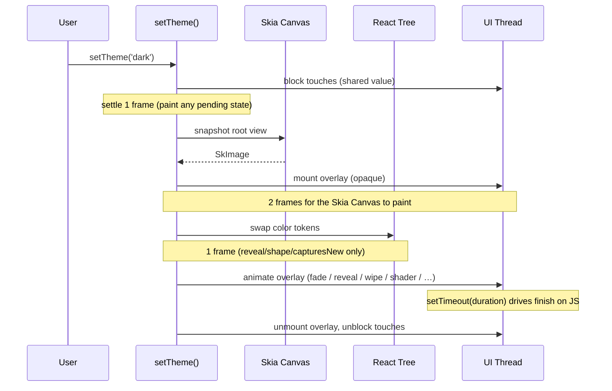

# How It Works

Every transition uses the same trick. Take a picture of what's on
screen, put it on top, change the colors underneath, then animate
the picture away. The picture is a Skia `SkImage`. The animation
runs on the UI thread via Reanimated. No Reduce Motion checks and
no magic defaults beyond the per-kind durations.

## The Two-Commit Flow



## Step by Step

1. `setTheme('dark')` runs. Touches are blocked immediately through
   a Reanimated shared value, with no re-render and no JS round-trip.
2. The engine waits **one frame** (`SETTLE.beforeCapture`). This
   gives any state updated in the same tick (a pressed highlight,
   an optimistic picker selection) time to paint before the
   snapshot.
3. The root view is snapshotted into a Skia `SkImage` via Skia's
   `makeImageFromView`.
4. The snapshot is mounted as an opaque overlay covering the entire
   provider.
5. **Two frames** for the Skia Canvas to actually paint the overlay
   on the GPU (`SETTLE.skiaPaint`). Without this wait, Android can
   flash the new theme through during the inner-tree color swap.
6. Color tokens swap underneath. The provider updates its context,
   every consumer re-renders with the new theme. Invisible, because
   the overlay is still fully opaque on top.
7. **One frame** for the tree to commit and repaint
   (`SETTLE.treeRepaint`). Only for reveal-style and shape
   transitions that expose the inner tree through a growing hole,
   plus slide and pixelize that capture a second snapshot. Fade,
   wipe, split, and dissolve skip this wait because the overlay
   covers everything until the animation resolves.
8. The overlay animates: fade, expanding shape, wipe, slide, split,
   pixelize, or dissolve. Every variant runs entirely on the UI
   thread via Reanimated worklets.
9. A `setTimeout` matched to the animation duration fires the
   finish handler on the JS thread, which unmounts the overlay and
   unblocks touches.

## The Settle Pattern

Three short waits, each doing exactly one job.

| Wait | Frames | Why |
|---|---|---|
| `SETTLE.beforeCapture` | 1 | Let any state updated in the same tick paint before the snapshot. |
| `SETTLE.skiaPaint` | 2 | Let the Skia Canvas actually draw on GPU before the inner-tree color swap. |
| `SETTLE.treeRepaint` | 1 | Let Android repaint deep ScrollView children before a reveal or shape animation exposes them. |

The values are tuned empirically and confirmed on both iOS and
Android. `SETTLE.treeRepaint` is gated to the kinds of transitions
that actually need it, so fade and wipe save one frame of latency.

## Why Snapshots?

Most theme-transition libraries use a custom native module to
manipulate the view hierarchy directly. The snapshot approach runs
entirely on Skia and Reanimated, both bundled in modern Expo SDKs,
so it works in Expo Go without a prebuild.

The trade-off is that the overlay is a still image. Any live
content behind it (a video, a Lottie animation, a camera preview, a
ticking counter) is frozen for the transition's duration. That's
typically a few hundred milliseconds; nobody notices in practice.

## Why No Reduce Motion?

The library is policy-free on accessibility. There is no built-in
Reduce Motion check, for two reasons.

1. Theme transitions are brief color changes, not spatial motion.
   They don't trigger vestibular discomfort the way a slide-in
   modal does.
2. Apps that *do* want to respect the OS setting may want different
   policies: disable entirely, fall back to fade, halve the
   duration. Hard-coding one of those would be wrong for everyone
   else.

If you want to honor the OS setting, read it yourself and pass
`animated: false`.

```tsx
import { AccessibilityInfo } from 'react-native'

const reduced = await AccessibilityInfo.isReduceMotionEnabled()
setTheme('dark', reduced ? { animated: false } : undefined)
```

That's the whole API for it. Decide your own policy.

## See Also

- [setTheme reference](../api/use-theme.md#settheme). Every option, every variant.
- [Callbacks](../guides/callbacks.md). When each callback fires and why.
- [Troubleshooting](../guides/troubleshooting.md). Common gotchas.
